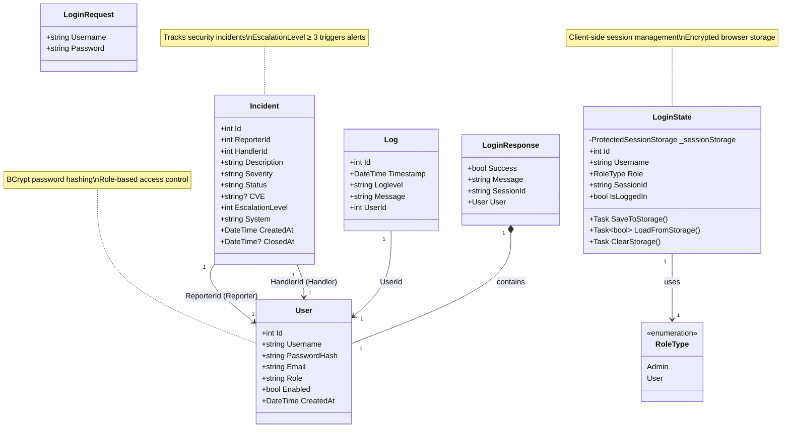

 <!-- banner funktioniert in github nicht deshalb wurde es auskommentiert
 <div style="
  background: url('https://cdn.wallpapersafari.com/37/76/wG15dM.jpg') center/cover no-repeat;
  padding: 40px;
  border-radius: 20px;
  min-height: 350px;">
  
<h1 style="color:#6dc849; font-weight: 700; text-shadow: 2px 2px 10px #000;"> SIMS - Security Incident Management System</h1>
  <p style="color:#fafdff; font-size: 1.2em; text-shadow: 1px 1px 6px #000;">
  </h1>
  <p style="color: #ffffff; font-size: 1.15em; text-shadow: 1px 1px 8px #222;">
 
  </p>
</div>
<div style="
    background: #233f39;
  bcolor: #fafdff;
  padding: 36px 24px;
  border-radius: 24px;
  min-height: 300px;">
-->


# <h1 style="color: #ffffff; font-weight: bold;">💎 SIMS - Security Incident Management System</h1>
## <h1 style="color: #ffffff; font-weight: bold;">📋 Beschreibung</h1>

SIMS (Security Incident Management System) ist ein System zum Protokollieren und Verwalten von IT-Sicherheitsvorfällen. Es ermöglicht die manuelle Erfassung von sicherheitsrelevanten Vorfällen, Eskalation an zuständige Bearbeiter, Benutzer- und Rollenverwaltung sowie Benachrichtigungen über verschiedene Kanäle.

## <h1 style="color: #ffffff; font-weight: bold;">✨ Features</h1>

- **📝 Vorfall-Management**: Erstellen, Bearbeiten und Schließen von Security-Incidents
- **🤖 Eskalationssystem**: Automatische Weiterleitung mithilfe eines Chatbots
- **👤 Benutzerverwaltung**: Rollenbasierte Zugriffskontrolle (z. B. Administrator, Benutzer), Nutzer aktivieren/deaktivieren
- **📋 Logging**: Vollständige Protokollierung aller Systemaktivitäten
- **🔗 Session-Management**: Redis für Session-State, damit z. B. der Vorfall-Entwurf bei Abbruch weiterbearbeitet werden kann
- **⚡ API-Integration**: Authentifizierung und User-Management als Microservice
- **📨 Notifizierungen**: Übermittlung mithilfe von Chatbot (BOT-Tom)
- **🐳 Dockerized**: Alle Hauptkomponenten laufen in eigenen Docker Containern in einem separaten Network (momentan nur SQL-DB & Redis)

## <h1 style="color: #ffffff; font-weight: bold;">🚀 Systemvoraussetzungen</h1>

- **Betriebssystem**: Windows 11, Linux (Ubuntu 20.04+), macOS 11+
- **Runtime**: .NET 7.0 SDK
- **Docker**: Docker Desktop 4.0+ oder Docker Engine 20.10+
- **RAM**: Minimum 4 GB
- **Festplatte**: 2 GB freier Speicher
- **Git**: GIT-Account auf  [https://git.nwt.fhstp.ac.at](https://git.nwt.fhstp.ac.at/)  oder Github (Projektverwaltung)

##  <h1 style="color: #ffffff; font-weight: bold;">📦 Installation und Start</h1>

<details> <summary>🛠️ Klicken für Installationsschritte</summary>
<h3 style="color: #ffffff; font-weight: bold;"> 1️⃣ Repository klonen </h3>

```
git clone GIT-REPO-URL
cd SIMS
```

### <h3 style="color: #ffffff; font-weight: bold;"> 🐳 2️⃣ Docker-Container starten </h3>

```
cd Docker
docker-compose up -d
```

### <h3 style="color: #ffffff; font-weight: bold;"> 💡 2.1 Docker einzeln starten (Alternative)


### <h4 style="color: #ffffff; font-weight: bold;">  SQL-Container für das Projekt</h4>
```
docker run -e "ACCEPT_EULA=Y" -e "SA_PASSWORD=YourStrong@Passw0rd" \
  -p 1433:1433 --name db-1 --hostname db-1 \
  -d mcr.microsoft.com/mssql/server:2022-latest
```
### <h4 style="color: #ffffff; font-weight: bold;"> Redis-Container fürs Projekt</h4>
```
docker run -d --name redis-1 -p 6379:6379 redis:latest
```
### <h4 style="color: #ffffff; font-weight: bold;"> Test: Session per API in Redis schreiben</h4>
```
curl -X POST "http://localhost:5013/api/session?key=testuser&value=john_doe"
```
### <h4 style="color: #ffffff; font-weight: bold;"> Test: Session in Redis überprüfen</h4>
```
docker exec -it redis-1 redis-cli
get testuser
```


## <h2 style="color: #ffffff; font-weight: bold;">🗄️ 3️⃣  Datenbank initialisieren</h2> 
### <h4 style="color: #ffffff; font-weight: bold;"> 3.1 SQL Container starten (falls nicht schon geschehen) </h4> 

```
docker run -e "ACCEPT_EULA=Y" -e "SA_PASSWORD=YourStrong@Passw0rd" -p 1433:1433 --name db-1 --hostname db-1 -d mcr.microsoft.com/mssql/server:2022-latest
docker exec -it sims-sqlserver /opt/mssql-tools/bin/sqlcmd -S localhost -U sa -P "YourStrong@Passw0rd" -i /docker-entrypoint-initdb.d/create_database.sql
```

### <h4 style="color: #ffffff; font-weight: bold;"> 🚀 4️⃣ Anwendung starten </h4>
```
docker exec -it sims-app dotnet SIMS.App.dll
```
### <h4 style="color: #ffffff; font-weight: bold;">🔑  Anleitung zur Passworthash Migration von bestehenden SQL Datenbanken:</h4> 

- in der SIMS.API Applikation im Program.cs Zeilen 67-110 wieder reinkommentieren
- die Zeilen 67-110 in Program.cs sorgen dafür, dass alle bestehenden User Passwörter gehashed werden
- Anschließend die Applikation einmal starten, damit die Migration durchgeführt wird
- die Zeilen 67-110 sollen nur für die einmalige Passworthash Migration aktiviert werden
- danach wieder auskommentieren, damit die Passwörter nicht bei jedem Start erneut gehashed werden
  </p>

</details>

##   <h1 style="color: #ffffff; font-weight: bold;">🏗️ Architektur</h1>

```
┌─────────────────────────────────────────────────────────┐
│                      SIMS.Web                           │
│                  (Blazor Server)                        │
│                   Port: 7167                            │
│                                                         │
│  ┌──────────────┐  ┌──────────────┐  ┌──────────────┐ │
│  │   Login      │  │  Incidents   │  │    Users     │ │
│  │   Component  │  │  Management  │  │  Management  │ │
│  └──────────────┘  └──────────────┘  └──────────────┘ │
│                                                         │
│  ┌──────────────────────────────────────────────────┐  │
│  │         LoginState (Session Service)             │  │
│  │      ProtectedSessionStorage (Browser)           │  │
│  └──────────────────────────────────────────────────┘  │
└───────────────────────┬─────────────────────────────────┘
                        │ HTTPS
                        │ API Key Auth
                        ▼
┌─────────────────────────────────────────────────────────┐
│                      SIMS.API                           │
│                  (ASP.NET Core)                         │
│                   Port: 7168                            │
│                                                         │
│  ┌──────────────┐  ┌──────────────┐  ┌──────────────┐   │
│  │   Login      │  │  Incidents   │  │    Users     │   │
│  │  Controller  │  │  Controller  │  │  Controller  │   │
│  └──────────────┘  └──────────────┘  └──────────────┘   │
│                                                         │
│  ┌──────────────────────────────────────────────────┐   │
│  │         SimsDbContext (EF Core)                  │   │
│  └──────────────────────────────────────────────────┘   │
└─────────┬───────────────────────────────┬───────────────┘
          │                               │
          ▼                               ▼
┌─────────────────────┐        ┌──────────────────────┐
│    SQL Server       │        │       Redis          │
│   (Port: 1433)      │        │    (Port: 6379)      │
│                     │        │                      │
│  ┌───────────────┐  │        │  ┌────────────────┐  │ 
│  │     Users     │  │        │  │    Sessions    │  │
│  │   Incidents   │  │        │  │   (TTL: 60m)   │  │
│  └───────────────┘  │        │  └────────────────┘  │
└─────────────────────┘        └──────────────────────┘
          │
          │ Alerts (EscalationLevel ≥ 3)
          ▼
┌─────────────────────┐
│   Telegram Bot      │
│   (External API)    │
└─────────────────────┘
```


### <h3 style="color: #ffffff; font-weight: bold;">🔡  ER-Diagramm  </h3>

```
+----------------------+
|        User          |
+----------------------+
| + Id : int           |
| + Username : string  |
| + PasswordHash : string |
| + Email : string     |
| + Role : string      |
| + Enabled : bool     |
| + CreatedAt : DateTime |
+----------------------+
           |
           | 1         (Reportet)
           |----------<  n
           |             |
           v             v
+----------------------+
|      Incident        |
+----------------------+
| + Id : int           |
| + ReporterId : int   | ---+  (FK -> User)
| + HandlerId : int    | ---+
| + Description: string|
| + Severity: string   |
| + Status: string     |
| + CVE: string        |
| + EscalationLevel: int|
| + System: string     |
| + CreatedAt: DateTime|
| + ClosedAt: DateTime?|
+----------------------+
          

```

### <h3 style="color: #ffffff; font-weight: bold;">🗃️ Redis Datenbank  </h3> 
```
| Key Pattern                  | Value Type            | Example             | Purpose                                    |
|------------------------------|-----------------------|---------------------|--------------------------------------------|
| session:{sessionId}          | String                | 1\|admin\|Admin     | User session data (userId\|username\|role) |
| last_access                  | DateTime              | 2024-11-21 10:30:45 | Last API access timestamp                  |
| last_incident_created        | Integer               | 42                  | ID of most recently created incident       |
| incident:{id}:last_viewed    | DateTime              | 2024-11-21 10:30:45 | Last time incident was viewed              |
| incident:{id}:created        | DateTime              | 2024-11-21 09:15:30 | Incident creation timestamp                |
| incident:{id}:last_updated   | DateTime              | 2024-11-21 11:45:00 | Last update timestamp                      |
| incident:{id}:deleted        | DateTime              | 2024-11-21 12:00:00 | Deletion timestamp                         |
```
-   User (Administrator, Benutzer, aktiviert/deaktiviert)
    
-   Incident (Status, CVE, Zeitstempel, Handler, Reporter, Alert-Level (Escalation Level), Severity, System, Beschreibung)

-   Log (LoginSessions, IncidentSessions) --> in Redis-DB

### <h2 style="color: #ffffff; font-weight: bold;"> 📊 Klassendiagramm  </h2> 



### <h3 style="color: #ffffff; font-weight: bold;"> 🐳 Docker-Architektur </h3>
```
      ┌──────────────────────┐
      │     SIMS.App         │
      │     (Console)        │
      └───┬────────────┬─────┘
          │            │  
     ┌────▼─────┐  ┌───▼─────────┐
     │ Redis    │  │ SIMS.Api    │
     │(Session) │  │ (Rest API)  │
     └──────────┘  └─────┬───────┘
                         │
                   ┌─────▼───────┐
                   │ SQL Server  │
                   │ (SIMSDB)    │
                   └─────────────┘
````
## 🛡️ Sicherheit

### <h3 style="color: #ffffff; font-weight: bold;"> Aktueller Stand  </h3>

- **👤 Authentifizierung & Sessions**
  - Login über die API, Session-Daten werden in Redis gespeichert (`RedisSessionService`).
  - Ein API-Key ist in der Konfiguration vorgesehen (`Security:ApiKey`), um geschützte Endpunkte abzusichern.

- **🔒 Passwortschutz**
  - Passwörter werden nicht im Klartext gespeichert, sondern vor dem Speichern gehasht (`PasswordHasher`).
  - Damit landen echte Passwörter weder in der Datenbank noch in Logs.

- **🗄️ Datenbankzugriff**
  - Zugriff auf SQL Server erfolgt ausschließlich über Entity Framework Core (parametrisierte Zugriffe, keine selbstgebauten SQL-Strings) → reduziert das Risiko klassischer SQL-Injection.
  - Das Schema (User, Incident, Log) wird über EF-Migrations verwaltet.

- **🚚 Transport & Konfiguration**
  - Die API ist für HTTPS-Betrieb ausgelegt (Kestrel Dev-Zertifikat).
  - Sensible Werte wie ConnectionStrings, API-Key und Telegram-Bot-Token liegen in `appsettings*.json` und können für produktive Umgebungen über Environment-Variablen/Secret-Store gesetzt werden.

- **🕵️‍♂️ Nachvollziehbarkeit**
  - Incidents speichern Zeitstempel (CreatedAt/ClosedAt), Reporter/Handler und Severity.
  - Redis wird genutzt, um z. B. `last_access` oder `last_incident_created` für einfache Session-/Aktivitätsverfolgung zu halten.


### <h3 style="color: #ffffff; font-weight: bold;"> Mögliche Security-Erweiterungen </h3>
- **🎚️ Rollen & Rechte schärfen**  
  Admin-Endpunkte klar trennen und nur für Admin-Rollen freigeben.

- **🔑  Login & Sessions absichern**  
  Rate-Limiting, Lockout nach mehreren Fehlversuchen, kürzere Session-Dauer.

- **🧩 Secrets sicher speichern**  
  DB-Passwort, API-Key, Bot-Token per Environment-Variablen / Secret-Store statt in `appsettings.json`.

- **📋 Audit-Logs nutzen**  
  Log-Tabelle verwenden für wichtige Aktionen (Logins, Rollenänderungen, Incident-Eskalationen).

- **🕸️ HTTP-Schnittstelle härten**  
  Security-Header setzen und technische Details in Fehlermeldungen nach außen vermeiden.

- **💻 Automatisierte Code-Scans**  
  Semgrep regelmäßig in einer CI-Pipeline laufen lassen.


####   <h1 style="color: #ffffff; font-weight: bold;">🔒 SAST</h1> 

### <h3 style="color: #ffffff; font-weight: bold;"> Semgrep Prüfung </h3> 

``` 
bash
semgrep --config=auto .
```

- 🧹 Code Smells vermeiden: Clean Code, Rollenprüfungen, Sicherstellung parametrisierter SQL-Queries (Dapper/EF), Authentifizierung mit Token (JWT)
- 🗒️ Findings dokumentieren: (z. B. 0 Critical, 2 Medium, 4 Low)
- 🛡️ XSS: Nicht relevant (keine Web-Oberfläche)
- 🔑 Passwortschutz: Alle Passwörter gehasht

<details> <summary>Klicken für Semgrep-Ergebnisse</summary>**Findings**:


```
──── ○○○ ────┐
│ Semgrep CLI │
└─────────────┘

Scanning 86 files (only git-tracked) with:

✔ Semgrep OSS
  ✔ Basic security coverage for first-party code vulnerabilities.

✘ Semgrep Code (SAST)
  ✘ Find and fix vulnerabilities in the code you write with advanced scanning and expert security rules.

✘ Semgrep Supply Chain (SCA)
  ✘ Find and fix the reachable vulnerabilities in your OSS dependencies.

💎 Get started with all Semgrep products via `semgrep login`.
✨ Learn more at https://sg.run/cloud.

  ━━━━━━━━━━━━━━━━━━━━━━━━━━━━━━━━━━━━━━━━ 100% 0:00:00
```


```
┌─────────────────┐
│ 4 Code Findings │
└─────────────────┘

    SIMS.API/Controllers/SessionController.cs
    ❯❱ csharp.dotnet.security.mvc-missing-antiforgery.mvc-missing-antiforgery
          Set is a state-changing MVC method that does not validate the antiforgery token or do strict     
          content-type checking. State-changing controller methods should either enforce antiforgery tokens
          or do strict content-type checking to prevent simple HTTP request types from bypassing CORS      
          preflight controls.
          Details: https://sg.run/Y0Jy     

           16┆ [HttpPost]
           17┆ public IActionResult Set([FromQuery] string key, [FromQuery] string value)
           18┆ {
           19┆     _service.SetSession(key, value);
           20┆     return Ok();
           21┆ }

    SIMS.API/Dockerfile
   ❯❯❱ dockerfile.security.missing-user-entrypoint.missing-user-entrypoint
          By not specifying a USER, a program in the container may run as 'root'. This is a security  
          hazard. If an attacker can control a process running as root, they may have control over the
          container. Ensure that the last USER in a Dockerfile is a USER other than 'root'.
          Details: https://sg.run/k281

           ▶▶┆ Autofix ▶ USER non-root ENTRYPOINT ["dotnet", "SIMS.API.dll"]
           29┆ ENTRYPOINT ["dotnet", "SIMS.API.dll"]

    SIMS.API/appsettings.json
   ❯❯❱ generic.secrets.security.detected-telegram-bot-api-key.detected-telegram-bot-api-key
          Telegram Bot API Key detected
          Details: https://sg.run/nd4b 

           26┆ "BotToken": "8213041452:AAGWnzP24LhV57jRdoaP0IA-JOcpuDCrtik",

    SIMS.Web/Dockerfile
   ❯❯❱ dockerfile.security.missing-user-entrypoint.missing-user-entrypoint
          By not specifying a USER, a program in the container may run as 'root'. This is a security  
          hazard. If an attacker can control a process running as root, they may have control over the
          container. Ensure that the last USER in a Dockerfile is a USER other than 'root'.
          Details: https://sg.run/k281

           ▶▶┆ Autofix ▶ USER non-root ENTRYPOINT ["dotnet", "SIMS.Web.dll"]
           30┆ ENTRYPOINT ["dotnet", "SIMS.Web.dll"]
```

```
┌──────────────┐
│ Scan Summary │
└──────────────┘
✅ Scan completed successfully.
 • Findings: 4 (4 blocking)
 • Rules run: 133
 • Targets scanned: 86
 • Parsed lines: ~100.0%
 • Scan was limited to files tracked by git
 • For a detailed list of skipped files and lines, run semgrep with the --verbose flag
Ran 133 rules on 86 files: 4 findings.
💎 Missed out on 1390 pro rules since you aren't logged in!
⚡ Supercharge Semgrep OSS when you create a free account at https://sg.run/rules.

⏫ A new version of Semgrep is available. See https://semgrep.dev/docs/upgrading
Fazit zu den Findings:
Es wurden 4 Findings gefunden, keine davon kritisch, aber alle sicherheitsrelevant.
SessionController: POST /api/session ändert Serverzustand ohne CSRF-/Antiforgery-Schutz oder strikte Content-Type-Prüfung → in Produktion absichern oder entfernen.
Dockerfiles (API & Web): Container laufen aktuell als root → künftig eigenen, nicht-privilegierten User verwenden.
Telegram-Bot-Token liegt in appsettings.json → Token rotieren und in Zukunft nur über Environment-Variablen / Secret-Store, nicht im Git-Repo.
```

</details>

## <h1 style="color: #ffffff; font-weight: bold;"> 📊 Versionshistorie</h1> 

### <h3 style="color: #ffffff; font-weight: bold;"> Version 1.0.0 (2025-11-08)</h3> 
- Fertiges, dockerisiertes System für SQL Datenbank und Redis
- Entity Framework Core Integration / EF-Migration
- Vorfallmanagement & Logging
- Benutzerverwaltung & Authentifizierung (REST)
- Docker-Integration (Dockerfiles für API, Web noch in Weiterentwicklung)
- Redis Login- und IncidentSession Logging integriert
- Web-Frontend mit Login & Logout mit Web-Sessions
- Passwort Hashing
- Chatbot (BOT-Tom)
- Semgrep-Check
- SBOM erstellt

## <h1 style="color: #ffffff; font-weight: bold;"> 🗺️ Roadmap</h1> 

### <h3 style="color: #ffffff; font-weight: bold;"> Version 1.1.0 (geplant Q1 2026)</h3> 

- [ ] komplette Docker-Integration
- [ ] Erweiterung der Web-Applikaton (Einbau von Chatbot-Assistent)


### <h3 style="color: #ffffff; font-weight: bold;">Version 1.2.0 (geplant Q2 2026)</h3> 
- [ ] LDAP/Active Directory Integration
- [ ] Advanced Reporting & Analytics
- [ ] Mobile App (MAUI)
- [ ] Automatische CVE-Datenbank-Integration

## <h1 style="color: #ffffff; font-weight: bold;">📄 Lizenz</h1> 

MIT License

Copyright (c) 2025 SIMS Team

Permission is hereby granted, free of charge, to any person obtaining a copy...

## <h1 style="color: #ffffff; font-weight: bold;">👥 Mitwirkende</h1>  

<h3 style="color: #ffffff; font-weight: bold;"> 👩‍💻 Esra Aktas</h3>   
     Frontend Entwicklung, Klassendiagramm, Read Me, Docker, Webdesign, WebSession
<h3 style="color: #ffffff; font-weight: bold;">👩‍💻  Sophie Stereb </h3>
     Chat-Bot, Security Maßnahmen, Docker (Api&Web)
<h3 style="color: #ffffff; font-weight: bold;"> 👨‍💻 Sasa Vladuljevic </h3> 
      API-Entwicklung/Authentifizierung, Datenbank(SQL), Redis, SBOM, Password Hashing

## <h1 style="color: #ffffff; font-weight: bold;"> 🔗 Links</h1>  

- **GIT Repository**: https://github.com/Isinger35489/Projekt_SWAC/
- **Issue Tracker**: https://github.com/Isinger35489/Projekt_SWAC/issues

## <h1 style="color: #ffffff; font-weight: bold;">  📞 Support (in Außnahmefällen)</h1> 

Bei Fragen oder Problemen: sims-support@ustp-students.at

</div>